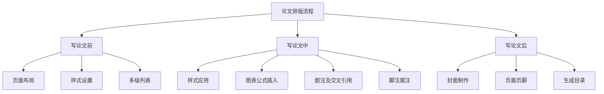

# Word Template for NPU Thesis

西北工业大学本科毕业设计论文模板（word 版本）

注意：该模板仅对Microsoft Office Word适配，WPS等可能会有功能缺失或排版异常的状况！

## 使用说明

1. 设置个人模板保存位置

   + 打开word文档，点击左上角`文件`，然后选择`选项`；
   + 在word选项中选择`保存`，如下图，设置自己的 **默认个人模板位置** 并保存。

   

2. 应用模板

   将`NPU本科毕业设计（论文）模板.dotx`放置在上述配置的路径中，即可在Word`新建 - 个人 - NPU本科毕业设计（论文）模板`以模板新建文档。

## 注意事项以及常见问题

1. 在进行过以下操作后会出现引用编号错误的情况，包括但不限于更改章节、插入公式、插入图表等，可进行 **更新域** 操作后恢复正常，操作方法：`Ctrl + A`全选后按`F9`或`右击-更新域`，选择`更新整个目录`即可；
2. 表格样式没有在表后空一行，需要自行空行操作。

## 具体的论文排版流程

### 一、论文排版流程

> 根据写作流程可以划分为三个阶段

**注意注意：多多`Ctrl+S`，学会分版本命名** 

### 二、页面布局、样式及多级列表设置

模板中根据NPU论文要求已经设置了基本的样式，如下：

> 论文正文：用于论文正文
>
> 标题1：用于一级标题
>
> 标题2：用于二级标题
>
> 标题3：用于三级标题
>
> 标题：用于摘要、目录、参考文献等不需要添加章节标签的标题
>
> 公式：用于公式
>
> 公式名：用于公式编号
>
> 图：用于图
>
> 图名：用于图标题
>
> 表：用于表
>
> 表名：用于表标题

**建议插入公式、图和表格的时候使用`插入 -> 文本 -> 文档部件 -> 自动图文集`更加方便快捷** 

### 三、图表样式应用、题注交叉引用及脚注尾注

#### 3.1 图表及表格样式的应用

对于表格设置了以下两种表格样式：

+ 普通表格
+ 三线表

可根据需要自行在`表设计`中设置表样式

**注意事项：**

1. 插入图片时一定要保证图片布局为 **嵌入型** ；
2. 插入表格后需要自行选择表格并在`开始 -> 样式`中选择表样式，并且注意表格后需要按照要求空一行

#### 3.2 插入题注及交叉引用

**插入题注**：点击`引用 -> 题注 -> 插入题注`，选择合适的标签（已内置包含章节序号的图标签和表标签）点击确定即可插入题注；（**建议不要自行插入题注，插入公式、图和表格的时候使用`插入 -> 文本 -> 文档部件 -> 自动图文集`更加方便快捷** ）

**交叉引用**：点击`引用 -> 题注 -> 交叉引用`，选择引用类型，选择引用内容为 **仅标签和编号**，选择题注插入即可

**[插入表目录]**：当需要插入表目录时，点击`引用 -> 题注 -> 插入表目录`

**注意事项：**

1. 对于插入的题注格式不正确（`图二-1 xxx`或`表二-1 xxx`）的问题可通过[附录一](#附录一：如何将含章节号的题注编号以阿拉伯数字显示)的方法进行更正，**非常建议在所有工作完成 定稿后再操作！**；
2. 插入表目录需要分图目录和表目录两次生成；
3. 快捷键`F4`（重复上一部操作）可能会让工作效率提升哦~

#### 3.3 关于如何使用自动图文集进行插入公式、图和表

如题，在`插入 -> 文本 -> 文档部件 -> 自动图文集`中可选择公式、图或表格插入到文本中，对插入的图文集稍作修改即可，省时省力MAX！~

### 附录一：如何将含章节号的题注编号以阿拉伯数字显示

1. `Alt + F9`显示域代码；
2. 将`{ STYLEREF 1 \s }-{ SEQ 表 \* ARABIC \s 1 }`中的`{ STYLEREF 1 \s }`替换为`{ QUOTE "一九一一年一月{ STYLEREF 1 \s }日" \@ "D" }`即可；
3. 注意上述的`{}`为域容器，快捷键为`Ctrl + F9`。

## 贡献

如果你在使用过程中发现任何问题，可以[提交Issues](https://github.com/Sirius0v0/word-template-for-NPU-thesis/issues) 、联系我（jonny@mail.nwpu.edu.cn）或自行 fork 修改后提交 pull request。

## 许可证

本项目使用 [`GPL-3.0 License`](https://choosealicense.com/licenses/gpl-3.0/) 作为开源许可证。
